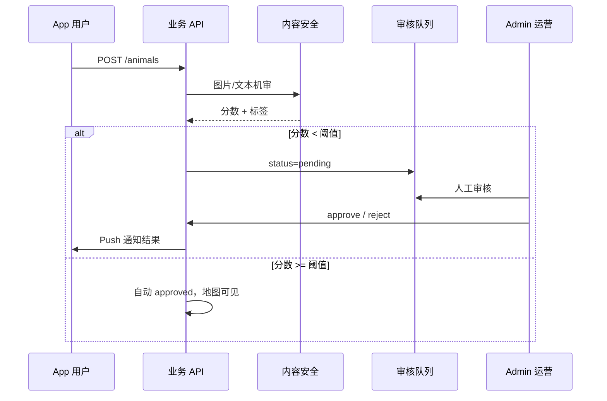
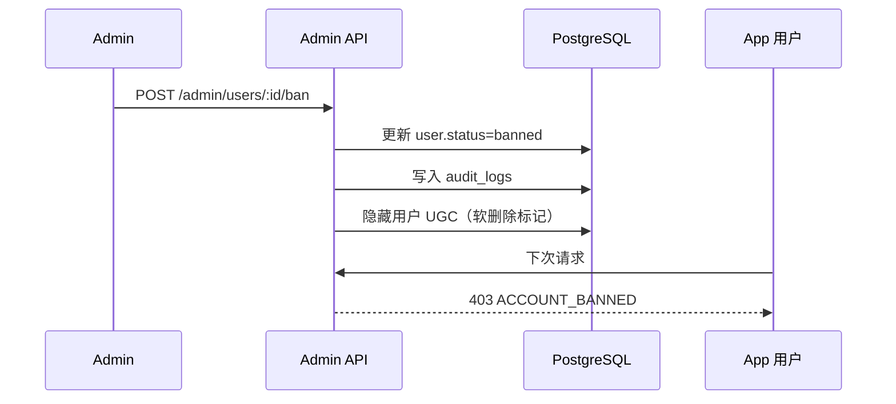

# 小流浪城市地图 — Admin 管理系统规划

> 面向平台运营、内容审核、组织管理与数据监控的后台管理系统设计。与 [technical-design.md](./technical-design.md)、[ui-design.md](./ui-design.md)、[development-plan.md](./development-plan.md) 对齐。

---

## 1. 系统定位

### 1.1 目标用户

| 角色 | 典型使用者 | 核心诉求 |
|------|------------|----------|
| 超级管理员 | 平台创始人/技术负责人 | 全站配置、角色分配、系统监控 |
| 运营管理员 | 平台运营 | 内容审核、活动配置、数据看板 |
| 城市管理员 | 各城市站长 | 本城内容审核、POI 维护、本地活动 |
| 组织管理员 | 志愿组织负责人 | 本组织成员、活动、救助案例（App 端 org_admin 的 Web 延伸） |
| 财务审核员 | 财务/合规 | 捐赠流水、提现审核、资金公示 |
| 客服 | 用户支持 | 用户查询、举报处理、申诉 |

### 1.2 系统边界

**Admin 负责**：
- UGC 审核与下架
- 用户/组织/品牌账号管理
- 运营配置（城市、标签、Banner、推荐位）
- 数据监控与报表
- 敏感操作审计

**Admin 不负责**（仍在 App 端）：
- 救助者日常状态更新
- 云家长互动
- 普通用户上报

**原则**：Admin 是「治理与运营层」，不替代 App 内的救助协作流程。

---

## 2. 技术方案

### 2.1 技术选型

| 项 | 选型 | 理由 |
|----|------|------|
| 框架 | **Next.js 15 (App Router)** | SSR、路由成熟、与 NestJS 同 TS 生态 |
| UI 库 | **shadcn/ui + Tailwind CSS** | 后台表格/表单/对话框组件齐全 |
| 表格 | TanStack Table | 复杂筛选、排序、分页 |
| 图表 | Recharts / ECharts | 数据看板 |
| 状态 | TanStack Query | 服务端数据缓存 |
| 表单 | React Hook Form + Zod | 与后端 DTO 校验一致 |
| 鉴权 | NextAuth.js 或 JWT Cookie | Admin 独立登录，与 App 用户体系隔离 |
| 部署 | Vercel / 云主机 Nginx | 内网或 IP 白名单访问（生产建议） |

### 2.2 架构

```
┌─────────────────────────────────────────────────────────┐
│              Admin Web (apps/admin)                      │
│  Next.js │ shadcn/ui │ TanStack Query │ Recharts        │
└─────────────────────────┬───────────────────────────────┘
                          │ HTTPS  /admin/api/v1/*
┌─────────────────────────▼───────────────────────────────┐
│              NestJS Admin Module (apps/api)              │
│  AdminGuard │ RBAC │ AuditLog │ 独立 AdminController     │
└─────────────────────────┬───────────────────────────────┘
                          │
          ┌───────────────┼───────────────┐
          ▼               ▼               ▼
    PostgreSQL         Redis          OSS（预览）
```

**与 App API 关系**：
- 共用同一 NestJS 实例，通过 `AdminModule` 隔离路由前缀 `/admin/api/v1`
- 共用 Prisma 数据层，Admin 操作写同一数据库
- Admin 鉴权使用独立 `admin_users` 表，不与 App `users` 混用

### 2.3 Monorepo 目录

```
apps/admin/
├── app/
│   ├── (auth)/login/
│   ├── (dashboard)/
│   │   ├── layout.tsx          # 侧边栏 + 顶栏
│   │   ├── page.tsx            # 概览看板
│   │   ├── moderation/         # 内容审核
│   │   ├── animals/
│   │   ├── users/
│   │   ├── organizations/
│   │   ├── events/
│   │   ├── finance/
│   │   ├── brands/
│   │   ├── lost-pets/
│   │   ├── map-pois/
│   │   ├── reports/            # 举报处理
│   │   ├── analytics/
│   │   └── settings/
│   └── api/                    # BFF 可选
├── components/
│   ├── layout/                 # Sidebar, Header, Breadcrumb
│   ├── data-table/
│   └── charts/
└── lib/
    ├── api-client.ts
    └── permissions.ts
```

---

## 3. 角色与权限（RBAC）

### 3.1 角色定义

| 角色代码 | 名称 | 数据范围 |
|----------|------|----------|
| `super_admin` | 超级管理员 | 全站 |
| `ops_admin` | 运营管理员 | 全站（无系统配置、无角色管理） |
| `city_admin` | 城市管理员 | 指定 `city_code` |
| `org_admin` | 组织管理员 | 指定 `organization_id` |
| `finance_auditor` | 财务审核员 | 全站资金只读 + 提现审核 |
| `support_agent` | 客服 | 用户只读 + 举报处理 |

### 3.2 权限矩阵

| 资源 / 操作 | super | ops | city | org | finance | support |
|-------------|:-----:|:---:|:----:|:---:|:-------:|:-------:|
| 概览看板 | ✓ | ✓ | 本城 | 本组织 | 财务概览 | — |
| 动物审核/下架 | ✓ | ✓ | 本城 | 本组织案例 | — | 只读 |
| 评论/互动审核 | ✓ | ✓ | 本城 | — | — | ✓ |
| 用户管理（封禁） | ✓ | ✓ | 本城 | — | — | 只读 |
| 组织管理 | ✓ | ✓ | 本城 | 本组织 | — | 只读 |
| 活动管理 | ✓ | ✓ | 本城 | 本组织 | — | — |
| 走失信息管理 | ✓ | ✓ | 本城 | — | — | ✓ |
| 捐赠/众筹查看 | ✓ | ✓ | 本城 | — | ✓ | — |
| 提现审核 | ✓ | — | — | — | ✓ | — |
| 品牌/赞助配置 | ✓ | ✓ | — | — | — | — |
| 地图 POI 管理 | ✓ | ✓ | 本城 | — | — | — |
| 运营配置（城市/标签/Banner） | ✓ | ✓ | 本城 | — | — | — |
| 数据报表 | ✓ | ✓ | 本城 | 本组织 | 财务 | — |
| Admin 账号/角色 | ✓ | — | — | — | — | — |
| 审计日志 | ✓ | 只读 | — | — | 资金相关 | — |

### 3.3 权限实现

```typescript
// packages/shared/src/admin-permissions.ts
@RequirePermission('animals:moderate')
@RequireScope('city')  // city_admin 自动注入 city_code 过滤
async moderateAnimal(@Param('id') id: string) { ... }
```

- 后端：`AdminGuard` + 装饰器校验 JWT 中的 `role` + `scopes`
- 前端：路由级 `<PermissionGate permission="animals:moderate">` 隐藏无权限菜单
- 数据隔离：`city_admin` 所有列表 API 强制附加 `WHERE city_code = :scope`

---

## 4. 功能模块

### 4.1 模块总览

```
Admin
├── 概览看板
├── 内容治理
│   ├── 审核队列（动物/评论/图片/私信）
│   ├── 动物管理
│   ├── 走失管理
│   └── 举报处理
├── 用户与组织
│   ├── App 用户
│   ├── 志愿组织
│   └── Admin 账号
├── 运营中心
│   ├── 活动管理
│   ├── 地图 POI
│   ├── 城市配置
│   ├── 标签管理
│   └── Banner / 推荐位
├── 商业合作
│   ├── 品牌入驻
│   └── 赞助关系
├── 资金中心
│   ├── 捐赠流水
│   ├── 众筹项目
│   ├── 钱包/提现审核
│   └── 资金公示配置
├── 数据分析
│   ├── 核心指标
│   ├── 城市对比
│   └── 导出
└── 系统设置
    ├── 审计日志
    ├── 内容审核规则
    └── 通知模板
```

---

### 4.2 概览看板（Dashboard）

**路由**：`/`

**卡片指标（MVP）**：

| 指标 | 说明 | 刷新 |
|------|------|------|
| 今日新增上报 | 动物上报数 | 实时 |
| 待审核内容 | 审核队列积压 | 实时 |
| 待处理举报 | 未关闭举报数 | 实时 |
| 7 日活跃用户数 | DAU 趋势 | 小时 |
| 救助状态分布 | 饼图：各状态占比 | 日 |
| 城市 Top 5 | 上报量/救助完成量 | 日 |

**图表（Phase 2+）**：
- 捐赠金额趋势（日/周/月）
- 云领养数量趋势
- 审核通过率 / 误杀申诉率

**快捷入口**：审核队列、最新举报、异常支付告警

---

### 4.3 内容审核（Moderation）

**路由**：`/moderation`

MVP 最核心的 Admin 模块，对应 App UGC 与内容安全要求。

#### 4.3.1 审核队列

| 队列 Tab | 来源 | 审核动作 |
|----------|------|----------|
| 动物上报 | 用户 `POST /animals` + 机审结果 | 通过 / 拒绝 / 要求修改 |
| 图片 | OSS 上传 + 内容安全 API | 通过 / 违规下架 |
| 评论 | `interactions` type=comment | 通过 / 删除 / 封禁用户 |
| 私信 | `messages`（Phase 3） | 删除 / 警告 / 封禁 |
| 走失信息 | `lost_pet_reports` | 通过 / 拒绝 |

**列表字段**：ID、缩略图、提交人、城市、机审分数、提交时间、状态

**详情页**：
- 左侧：内容预览（图片大图、文本、地图坐标）
- 右侧：机审结果明细、历史违规记录、操作按钮
- 底部：审核备注（必填，写入审计日志）

**状态流转**：

```
pending → approved → (published)
        → rejected → (通知用户原因)
        → needs_revision → (用户可重新提交)
```

**SLA 告警**：待审核 > 100 条或最久积压 > 24h 时 Dashboard 标红

#### 4.3.2 动物管理

**路由**：`/animals`

- 全站动物列表：筛选（城市、状态、物种、审核状态、上报时间）
- 操作：强制下架、恢复、修改标签、指派/变更救助者、查看时间轴
- 批量操作：批量下架（活动清理）
- 详情：关联媒体、评论、捐赠记录、操作日志

---

### 4.4 用户管理

**路由**：`/users`

| 功能 | 说明 |
|------|------|
| 用户列表 | 手机号（脱敏）、昵称、角色、城市、注册时间、状态 |
| 用户详情 | 上报记录、评论、捐赠、订阅、违规历史 |
| 封禁/解封 | 临时封禁（7/30 天）/ 永久；封禁原因必填 |
| 角色变更 | user → rescuer（需审核材料） |
| 实名/资质 | 救助者认证资料审核（可选） |

**封禁影响**：无法登录、内容隐藏、Push 停止

---

### 4.5 组织管理

**路由**：`/organizations`

| 功能 | 说明 |
|------|------|
| 组织列表 | 名称、城市、成员数、活动数、认证状态 |
| 入驻审核 | 提交资料 → 通过/拒绝 |
| 成员管理 | 添加/移除 org_admin |
| 组织详情 | 救助案例、活动、捐赠汇总 |

组织管理员（`org_admin`）登录 Admin 后仅见本组织 scoped 数据。

---

### 4.6 活动管理

**路由**：`/events`

- 活动列表：状态（草稿/进行中/已结束）、报名数、城市
- 审核：用户发起的活动需运营审核后公开
- 操作：下架、编辑、导出报名名单
- 详情：地图位置、封面、描述、报名用户

---

### 4.7 资金中心（Phase 2）

**路由**：`/finance`

| 子模块 | 功能 |
|--------|------|
| 捐赠流水 | 全站 tip/crowdfunding 流水，关联动物/用户，支持导出 CSV |
| 众筹项目 | 项目列表、进度、异常（超额/过期未关闭） |
| 提现审核 | 救助者/组织提现申请 → 财务审核通过/拒绝 |
| 资金公示 | 配置公示字段、生成公示页链接 |
| 对账 | 微信支付/支付宝账单与内部 Ledger 比对（日） |

**告警规则**：
- 单笔捐赠 > 阈值
- 短时间同一用户多次捐赠
- Ledger 与第三方支付不一致

---

### 4.8 品牌合作（Phase 4）

**路由**：`/brands`

| 功能 | 说明 |
|------|------|
| 品牌入驻 | Logo、名称、简介、联系人 |
| 赞助关系 | 绑定品牌 ↔ 动物/众筹/活动 |
| 专题页配置 | Banner、文案、跳转链接 |
| 任务配置 | 品牌任务积分规则 |

---

### 4.9 走失管理

**路由**：`/lost-pets`

- 列表：状态（寻找中/有线索/已找到）、城市、发布时间
- 审核：同内容审核队列
- 操作：强制关闭、区域告警重发、查看线索
- 地图预览：最后目击位置（精确坐标，仅 Admin 可见）

---

### 4.10 地图 POI 管理

**路由**：`/map-pois`

| POI 类型 | 管理内容 |
|----------|----------|
| 公益站 | 名称、地址、坐标、营业时间、联系方式 |
| 志愿点 | 同上 + 关联组织 |
| 热点 | 高发区域标注、说明 |

- 地图选点编辑器（嵌入高德 JS API 或坐标输入）
- 批量导入 CSV（city, name, lng, lat, type）

---

### 4.11 运营配置

**路由**：`/settings`

| 配置项 | 说明 |
|--------|------|
| 城市管理 | 城市 code、名称、中心坐标、默认 zoom、是否开放 |
| 标签管理 | 健康/性格等预设标签，App 上报可选 |
| Banner | 发现页/首页轮播，上下线时间 |
| 推荐位 | 手动置顶动物/活动 |
| 通知模板 | Push 文案模板（状态变更、审核结果） |
| 审核规则 | 敏感词库、机审阈值、自动通过条件 |

---

### 4.12 举报处理

**路由**：`/reports`

- 举报列表：举报人、被举报对象（动物/评论/用户）、原因、时间
- 处理：成立 → 触发下架/封禁；不成立 → 关闭
- 关联跳转：一键进入对应审核/用户详情

---

### 4.13 数据分析

**路由**：`/analytics`

| 报表 | 维度 | 阶段 |
|------|------|------|
| 核心指标 | DAU、上报量、救助完成率、审核时效 | MVP |
| 城市对比 | 各城市上报/救助/捐赠 | P1 |
| 用户留存 | 7/30 日留存 | P2 |
| 捐赠分析 | 金额分布、Top 捐赠者 | P2 |
| 漏斗 | 上报→认领→救助→领养 | P2 |

支持：日期范围筛选、CSV 导出、城市管理员仅看本城

---

### 4.14 审计日志

**路由**：`/settings/audit-logs`

记录所有 Admin 敏感操作：

| 字段 | 说明 |
|------|------|
| operator_id | Admin 操作人 |
| action | 如 `animal.approve`、`user.ban` |
| target_type / target_id | 操作对象 |
| before / after | JSON 快照（变更类） |
| ip / user_agent | 来源 |
| created_at | 不可篡改 |

保留 ≥ 1 年；`super_admin` 可检索，`finance_auditor` 仅看资金相关。

---

## 5. 页面布局与导航

### 5.1 布局结构

```
┌──────────────────────────────────────────────────────────┐
│  Logo   小流浪 Admin          🔔 告警   [管理员头像 ▾]    │
├────────────┬─────────────────────────────────────────────┤
│            │  面包屑：内容治理 / 审核队列                  │
│  概览      │                                             │
│  内容治理  │  ┌─────────────────────────────────────┐   │
│  用户组织  │  │                                     │   │
│  运营中心  │  │           主内容区                   │   │
│  资金中心  │  │     （表格 / 表单 / 图表）           │   │
│  数据分析  │  │                                     │   │
│  系统设置  │  └─────────────────────────────────────┘   │
│            │                                             │
└────────────┴─────────────────────────────────────────────┘
```

### 5.2 侧边栏菜单（按角色动态裁剪）

```
概览
内容治理
  ├─ 审核队列        [badge: 待审数]
  ├─ 动物管理
  ├─ 走失管理
  └─ 举报处理        [badge: 待处理]
用户与组织
  ├─ App 用户
  ├─ 志愿组织
  └─ Admin 账号      [super_admin only]
运营中心
  ├─ 活动管理
  ├─ 地图 POI
  └─ 运营配置
商业合作             [Phase 4]
资金中心             [Phase 2]
  ├─ 捐赠流水
  ├─ 众筹项目
  └─ 提现审核
数据分析
系统设置
  ├─ 审计日志
  └─ 审核规则
```

### 5.3 UI 规范（Admin 专用）

与 App 温暖风格区分，Admin 采用 **高效工具型** 设计：

| 项 | 规范 |
|----|------|
| 主色 | `#2D6A4F`（与 App 品牌一致） |
| 背景 | `#F8FAFC`（冷灰，减少视觉疲劳） |
| 字体 | Inter / 系统 sans，14px 表格正文 |
| 密度 | 紧凑模式，表格行高 48px |
| 组件 | shadcn/ui DataTable、Dialog、Sheet |
| 状态色 | 待审=amber、通过=green、拒绝=red、草稿=gray |

---

## 6. Admin API 设计

### 6.1 路由前缀

```
/admin/api/v1/*
```

与 App API `/api/v1/*` 隔离；Swagger 分组 `Admin`。

### 6.2 核心接口

| 方法 | 路径 | 说明 | 阶段 |
|------|------|------|------|
| POST | /admin/auth/login | Admin 登录 | MVP |
| GET | /admin/dashboard/stats | 看板指标 | MVP |
| GET | /admin/moderation/queue | 审核队列 | MVP |
| POST | /admin/moderation/:id/approve | 通过 | MVP |
| POST | /admin/moderation/:id/reject | 拒绝 | MVP |
| GET | /admin/animals | 动物列表 | MVP |
| PATCH | /admin/animals/:id | 强制下架等 | MVP |
| GET | /admin/users | 用户列表 | MVP |
| POST | /admin/users/:id/ban | 封禁 | MVP |
| GET | /admin/reports | 举报列表 | MVP |
| PATCH | /admin/reports/:id | 处理举报 | MVP |
| GET | /admin/organizations | 组织列表 | P1 |
| POST | /admin/organizations/:id/approve | 组织审核 | P1 |
| GET | /admin/events | 活动列表 | P1 |
| GET | /admin/finance/ledger | 捐赠流水 | P2 |
| POST | /admin/finance/withdrawals/:id/approve | 提现审核 | P2 |
| GET | /admin/brands | 品牌列表 | P4 |
| CRUD | /admin/map-pois | POI 管理 | P1 |
| CRUD | /admin/settings/cities | 城市配置 | MVP |
| GET | /admin/audit-logs | 审计日志 | MVP |
| GET | /admin/analytics/* | 报表数据 | P1 |

### 6.3 数据模型补充

#### admin_users

| 字段 | 类型 | 说明 |
|------|------|------|
| id | UUID | |
| email | VARCHAR | 登录账号 |
| password_hash | VARCHAR | bcrypt |
| name | VARCHAR | 显示名 |
| role | ENUM | super_admin / ops_admin / ... |
| scopes | JSONB | `{ city_codes: [], org_ids: [] }` |
| status | ENUM | active / disabled |
| last_login_at | TIMESTAMPTZ | |

#### moderation_records

| 字段 | 类型 | 说明 |
|------|------|------|
| id | UUID | |
| target_type | ENUM | animal / comment / image / lost_pet / message |
| target_id | UUID | |
| status | ENUM | pending / approved / rejected / needs_revision |
| machine_score | FLOAT | 机审分数 |
| reviewer_id | UUID? | Admin 审核人 |
| reason | TEXT | 拒绝/备注 |
| created_at | TIMESTAMPTZ | |

#### audit_logs

| 字段 | 类型 | 说明 |
|------|------|------|
| id | UUID | |
| operator_id | UUID | admin_users.id |
| action | VARCHAR | 动作码 |
| target_type | VARCHAR | |
| target_id | UUID | |
| payload | JSONB | before/after |
| ip | INET | |
| created_at | TIMESTAMPTZ | |

---

## 7. 安全要求

| 项 | 要求 |
|----|------|
| 登录 | 邮箱+密码；可选 MFA（Phase 2） |
| 会话 | HttpOnly Cookie 或短 JWT；30min 无操作退出 |
| 密码 | ≥12 位，bcrypt cost 12 |
| 网络 | 生产环境 IP 白名单或 VPN 访问 |
| 权限 | 后端强制 RBAC，前端仅做 UI 裁剪 |
| 审计 | 所有写操作记 audit_logs |
| 敏感数据 | 手机号/身份证中间段脱敏展示 |
| 导出 | 大批量导出需 super_admin 审批（Phase 2） |
| 速率限制 | 登录 5 次/分钟；API 100 req/min/admin |

---

## 8. 开发分期

与 [development-plan.md](./development-plan.md) 对齐：

### Phase 0（第 2 周）— Admin 脚手架

| 任务 | 工期 |
|------|------|
| `apps/admin` Next.js + shadcn/ui 初始化 | 1d |
| 登录页 + Admin JWT 鉴权（后端 AdminModule） | 1d |
| 布局框架（Sidebar + Header + Breadcrumb） | 1d |
| `admin_users` 表 + 种子超级管理员 | 0.5d |

### Phase 1（第 9～10 周）— MVP Admin

| 任务 | 工期 |
|------|------|
| 概览看板（4 核心指标） | 1d |
| 审核队列（动物 + 评论） | 2d |
| 动物管理列表 + 强制下架 | 1d |
| 用户列表 + 封禁 | 1d |
| 举报处理 | 1d |
| 城市配置 CRUD | 0.5d |
| 审计日志（基础） | 0.5d |

**M1 验收**：运营可通过 Admin 完成内容审核与用户封禁，无需直接操作数据库。

### Phase 2（第 14～16 周）— 资金 Admin

| 任务 | 工期 |
|------|------|
| 捐赠流水列表 + 筛选导出 | 1d |
| 众筹项目管理 | 1d |
| 提现审核流程 | 2d |
| 财务概览卡片 | 0.5d |

### Phase 3（第 17～20 周）— 组织与活动

| 任务 | 工期 |
|------|------|
| 组织入驻审核 + 成员管理 | 2d |
| 活动审核与管理 | 1d |
| 地图 POI CRUD + 地图选点 | 2d |
| org_admin  scoped 登录 | 1d |

### Phase 4（第 21～24 周）— 品牌与数据

| 任务 | 工期 |
|------|------|
| 走失管理 | 1d |
| 品牌入驻 + 赞助配置 | 2d |
| 数据分析报表（城市对比、漏斗） | 2d |
| Banner/推荐位配置 | 1d |
| MFA + IP 白名单 | 1d |

### Phase 5 — 持续

- Elasticsearch 接入后台搜索
- 审核规则可视化配置
- 自定义报表
- Admin 操作回放

---

## 9. 关键业务流程

### 9.1 动物上报审核



### 9.2 用户封禁



---

## 10. 验收标准

### MVP Admin（M1）

- [ ] Admin 可登录，非授权角色无法访问
- [ ] 审核队列展示待审动物/评论，可一键通过/拒绝
- [ ] 拒绝必填原因，用户收到 Push
- [ ] 可强制下架已发布动物
- [ ] 可封禁/解封用户
- [ ] 看板展示待审数、今日上报量
- [ ] 所有审核/封禁操作有审计日志
- [ ] `city_admin` 只能看到本城数据

### 完整 Admin（M4）

- [ ] 资金流水可对账导出
- [ ] 组织/活动/品牌/POI 全流程可管理
- [ ] 数据分析报表可按城市筛选
- [ ] 生产环境 IP 白名单生效

---

## 11. 相关文档

- [technical-design.md](./technical-design.md) — 后端架构与 App API
- [ui-design.md](./ui-design.md) — App 端 UI 规范
- [development-plan.md](./development-plan.md) — 整体开发排期

待补充：`permissions.md`（App + Admin 统一权限矩阵）
