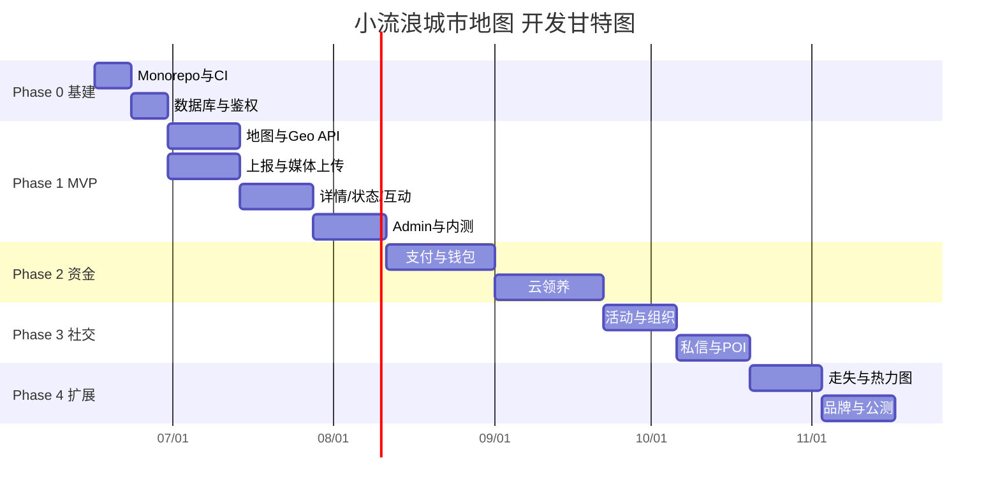

# 小流浪城市地图 — 开发计划

> 基于 [technical-design.md](./technical-design.md) 与 [ui-design.md](./ui-design.md) 拆解的可执行开发路线图。

---

## 1. 计划概览

### 1.1 目标

| 里程碑 | 目标 | 预计时间 |
|--------|------|----------|
| M0 | 工程可运行，CI 绿，本地一键启动 | 第 2 周末 |
| M1 | MVP 内测：地图 + 上报 + 状态跟踪 + 互动 | 第 10 周末 |
| M2 | 资金与云领养上线 | 第 16 周末 |
| M3 | 社交与组织联动 | 第 20 周末 |
| M4 | 品牌合作 + 走失找回 + 公测 | 第 24 周末 |
| M5 | 搜索推荐与多城市规模化 | 持续迭代 |

**总工期（核心功能）**：约 **24 周（6 个月）**

### 1.2 团队假设

本计划按 **小团队 3 人** 估算；若为 1 人全栈，工期 ×1.5～2。

| 角色 | 职责 | 投入 |
|------|------|------|
| 移动端 | Expo App、地图 SDK、UI 组件 | 全职 |
| 后端 | NestJS API、PostGIS、第三方集成 | 全职 |
| 全栈/运维 | Monorepo 基建、Admin、CI/CD、测试 | 0.5～1 人 |

### 1.3 技术栈（不变）

- **App**：React Native + Expo + 高德地图 + Expo Router
- **API**：NestJS + Prisma + PostGIS
- **基建**：pnpm Monorepo、Docker Compose、PostgreSQL、Redis、OSS

---

## 2. 阶段总览



---

## 3. Phase 0 — 工程基建（第 1～2 周）

**目标**：代码仓库可协作开发，本地环境一键启动，主干分支保护生效。

### 3.1 任务清单

| # | 任务 | 负责 | 工期 | 依赖 | 验收标准 |
|---|------|------|------|------|----------|
| 0.1 | 初始化 pnpm Monorepo（`apps/mobile`、`apps/api`、`packages/shared`） | 全栈 | 1d | — | `pnpm install` 成功 |
| 0.2 | 配置 ESLint / Prettier / TypeScript 共享配置 | 全栈 | 0.5d | 0.1 | 三端 lint 通过 |
| 0.3 | `docker-compose.yml`：PostGIS + Redis | 全栈 | 0.5d | — | `docker compose up` 可连 |
| 0.4 | NestJS 脚手架：模块结构、全局异常、ValidationPipe | 后端 | 1d | 0.1 | 健康检查 `GET /health` 200 |
| 0.5 | Prisma 初始化 + PostGIS 扩展启用 | 后端 | 1d | 0.3 | Migration 可跑，Geo 字段可用 |
| 0.6 | 用户表 + JWT 鉴权（短信登录 Mock） | 后端 | 2d | 0.5 | 登录/刷新 Token 可用 |
| 0.7 | Swagger OpenAPI 自动生成 | 后端 | 0.5d | 0.4 | `/api/docs` 可访问 |
| 0.8 | Expo 脚手架 + Expo Router Tab 骨架 | 移动端 | 1d | 0.1 | 5 Tab 空页面可导航 |
| 0.9 | Design Tokens（`theme/tokens.ts`）+ 基础 Button/Card | 移动端 | 1d | 0.8 | 与 ui-design.md 色值一致 |
| 0.10 | GitHub Actions：lint + typecheck + test | 全栈 | 1d | 0.1 | PR 触发 CI 绿 |
| 0.11 | 环境变量模板 `.env.example` | 全栈 | 0.5d | 0.3 | 文档说明各变量用途 |
| 0.12 | Admin 脚手架（Next.js + shadcn/ui + 登录页） | 全栈 | 1.5d | 0.4 | 见 [admin-design.md](./admin-design.md) |
| 0.13 | AdminModule + `admin_users` 表 + RBAC 基础 | 后端 | 1d | 0.6 | Admin JWT 登录可用 |

### 3.2 交付物

- [ ] Monorepo 目录结构就绪
- [ ] 本地开发文档（README 启动步骤）
- [ ] `users` 表 + 鉴权 API
- [ ] App Tab 导航骨架 + Design Tokens
- [ ] CI 流水线
- [ ] Admin 可登录（空壳布局 + 鉴权）

> Admin 详细模块规划见 [admin-design.md](./admin-design.md)

### 3.3 里程碑 M0 验收

- 新成员按 README 30 分钟内跑起 App + API + DB
- `master` 分支 PR 合并需 CI 通过

---

## 4. Phase 1 — MVP（第 3～10 周）

**目标**：完成「地图看动物 → 上报 → 跟踪状态 → 评论点赞 → 订阅通知」闭环，发布内测包。

### 4.1 迭代拆分

#### Sprint 1（第 3～4 周）：地图 + Geo 核心

| # | 任务 | 端 | 工期 | 验收标准 |
|---|------|-----|------|----------|
| 1.1 | `animals` 表 + GIST 索引 + 状态枚举 | 后端 | 1d | Migration 完成 |
| 1.2 | `GET /animals/map?bbox=` PostGIS 查询 | 后端 | 2d | 视口 500 点 P95 < 1s |
| 1.3 | `cities` 表 + 城市切换 API | 后端 | 1d | 返回中心点与默认 zoom |
| 1.4 | 高德地图 SDK 集成（定位、地图渲染） | 移动端 | 2d | 真机定位正常 |
| 1.5 | 自定义 AnimalMarker 组件（5 种状态色） | 移动端 | 2d | 与 ui-design Marker 色一致 |
| 1.6 | 地图视口变化 → debounce 请求 bbox 数据 | 移动端 | 1d | 拖动地图后 Marker 刷新 |
| 1.7 | MapHeader（城市切换 + 筛选入口） | 移动端 | 1d | 切换城市重置地图中心 |

#### Sprint 2（第 5～6 周）：上报 + 媒体

| # | 任务 | 端 | 工期 | 验收标准 |
|---|------|-----|------|----------|
| 1.8 | OSS STS 直传 + `media_assets` 表 | 后端 | 2d | 客户端可上传图片 |
| 1.9 | `POST /animals` 上报接口 | 后端 | 2d | 含坐标、标签、媒体关联 |
| 1.10 | GCJ-02 → WGS84 坐标转换（`packages/geo`） | 共享 | 1d | 单元测试覆盖 |
| 1.11 | 上报流程 UI（4 步 Modal） | 移动端 | 3d | 对应 screen-03 设计 |
| 1.12 | 上报草稿本地持久化（MMKV） | 移动端 | 1d | 杀进程后草稿保留 |
| 1.13 | 图片压缩 + 最多 9 张限制 | 移动端 | 1d | 单张 ≤ 10MB |
| 1.14 | 内容审核 API 接入（图片/文本） | 后端 | 2d | 违规内容不公开 |

#### Sprint 3（第 7～8 周）：详情 + 状态 + 互动

| # | 任务 | 端 | 工期 | 验收标准 |
|---|------|-----|------|----------|
| 1.15 | `GET /animals/:id` 详情 + 模糊坐标逻辑 | 后端 | 1d | 非救助者看不到精确地址 |
| 1.16 | 动物详情页 UI | 移动端 | 3d | 对应 screen-02 设计 |
| 1.17 | AnimalPeekSheet（地图底部预览） | 移动端 | 2d | 上滑进入详情，共享元素过渡 |
| 1.18 | 状态机服务 + `PATCH /animals/:id/status` | 后端 | 2d | 非法流转返回 422 |
| 1.19 | `animal_status_logs` + 时间轴 API | 后端 | 1d | `GET /animals/:id/timeline` |
| 1.20 | StatusStepper 组件（6 步可视化） | 移动端 | 1d | 当前步骤高亮 |
| 1.21 | `interactions` 表 + 评论/点赞 API | 后端 | 2d | `POST /interactions` |
| 1.22 | 详情页评论列表 + 点赞 | 移动端 | 2d | 乐观更新 |

#### Sprint 4（第 9～10 周）：发现 + 推送 + Admin MVP + 内测

| # | 任务 | 端 | 工期 | 验收标准 |
|---|------|-----|------|----------|
| 1.23 | 发现页 Feed API（推荐/附近排序） | 后端 | 2d | 分页 + 距离排序 |
| 1.24 | 发现页双列瀑布流 UI | 移动端 | 2d | 对应 screen-04 设计 |
| 1.25 | 多维筛选（物种/状态/距离） | 双端 | 2d | 地图与 Feed 筛选同步 |
| 1.26 | `subscriptions` 表 + 订阅/取消 API | 后端 | 1d | 用户可订阅动物 |
| 1.27 | 极光推送 SDK + 状态变更推送 | 双端 | 2d | 状态变更后收到 Push |
| 1.28 | 个人中心页 UI | 移动端 | 1d | 对应 screen-05 设计 |
| 1.29 | `moderation_records` + 审核队列 API | 后端 | 1d | 机审 + 人工队列 |
| 1.30 | Admin 审核队列页（动物/评论） | Admin | 2d | 通过/拒绝 + 原因 |
| 1.31 | Admin 动物管理 + 强制下架 | Admin | 1d | 列表筛选 + 下架 |
| 1.32 | Admin 用户管理 + 封禁 | Admin | 1d | 封禁后 App 403 |
| 1.33 | Admin 看板 + 举报处理 + 审计日志 | Admin | 1d | 4 核心指标 + 日志 |
| 1.34 | 短信登录（真实验证码） | 后端 | 1d | 替换 Mock |
| 1.35 | E2E 冒烟测试（上报→审核→地图可见） | 全栈 | 2d | CI 可跑 |
| 1.36 | TestFlight + 内测 APK 打包发布 | 移动端 | 1d | 内测群可安装 |

### 4.2 MVP 功能范围

| 包含 | 不包含（后续阶段） |
|------|-------------------|
| 地图 Marker + 预览 Sheet | 热力图 |
| 动物上报（图/文/定位/标签） | 支付/打赏 |
| 6 步状态机 + 时间轴 | 云领养 |
| 评论、点赞 | 私信 |
| 发现 Feed + 筛选 | 活动/组织 |
| 订阅 + Push 通知 | 走失找回 |
| 内容审核 + Admin | 品牌合作 |
| 手机号登录 | 微信登录 |

### 4.3 里程碑 M1 验收

- [ ] 用户可上报流浪动物并在地图上看到 Marker
- [ ] 救助者可更新状态，订阅者收到 Push
- [ ] 详情页可评论点赞，时间轴正确展示
- [ ] 违规内容在 Admin 可审核下架
- [ ] 内测包已分发，≥10 人完成完整流程测试
- [ ] API P95 < 300ms（常规接口）
- [ ] 地图 500 Marker P95 < 1s

---

## 5. Phase 2 — 资金与云领养（第 11～16 周）

**目标**：打通打赏/众筹资金流，上线云领养情感模块。

### 5.1 Sprint 5（第 11～13 周）：支付体系

| # | 任务 | 端 | 工期 | 验收标准 |
|---|------|-----|------|----------|
| 2.1 | 支付合规方案确认（定向打赏 vs 公募） | 产品 | 3d | 法务/产品签字 |
| 2.2 | `wallets` + `ledger_entries` + `payment_orders` 表 | 后端 | 2d | 双账本，禁止直接改余额 |
| 2.3 | 微信支付接入（App 下单 + 回调验签） | 双端 | 4d | 沙箱端到端通过 |
| 2.4 | 支付宝接入 | 双端 | 3d | 沙箱端到端通过 |
| 2.5 | `POST /payments/tip` 打赏接口 | 后端 | 2d | 幂等 + 流水可追溯 |
| 2.6 | 详情页打赏 Bottom Sheet UI | 移动端 | 2d | 微信/支付宝选择 |
| 2.7 | 众筹 `crowdfunding_projects` CRUD | 后端 | 2d | 进度百分比正确 |
| 2.8 | 众筹详情页 + 进度条 | 移动端 | 2d | 资金用途明细展示 |
| 2.9 | 捐赠流水公示页 | 双端 | 1d | 脱敏展示 |

### 5.2 Sprint 6（第 14～16 周）：云领养 + 激励

| # | 任务 | 端 | 工期 | 验收标准 |
|---|------|-----|------|----------|
| 2.10 | `cloud_adoptions` + `care_updates` 表 | 后端 | 2d | 一动物多云家长 |
| 2.11 | 云领养 API + 每日动态发布 | 后端 | 2d | 仅救助者可发动态 |
| 2.12 | 云领养详情页 + 祝福墙 | 移动端 | 3d | 留言/点赞/祝福 |
| 2.13 | `blessings` 祝福墙 API + UI | 双端 | 2d | 按动物聚合 |
| 2.14 | 勋章规则引擎 + `user_badges` | 后端 | 2d | 捐赠/救助触发 |
| 2.15 | 城市排行榜（Redis Sorted Set） | 后端 | 2d | 周榜/月榜 |
| 2.16 | 个人中心勋章展示 | 移动端 | 1d | 对应 profile 设计 |
| 2.17 | 成长档案生成（BullMQ + PDF） | 后端 | 3d | 可分享链接 |
| 2.18 | WebSocket：`animal:status_changed` | 双端 | 2d | 实时动态 Feed |
| 2.19 | Admin 捐赠流水 + 众筹管理 | Admin | 2d | 筛选 + CSV 导出 |
| 2.20 | Admin 提现审核流程 | Admin | 2d | 财务角色可用 |

### 5.3 里程碑 M2 验收

- [ ] 沙箱环境完成真实打赏全流程
- [ ] 众筹项目可创建、捐赠、查看进度
- [ ] 用户可云领养并收到每日动态 Push
- [ ] 勋章与排行榜数据正确
- [ ] 支付回调幂等测试通过

---

## 6. Phase 3 — 社交与组织（第 17～20 周）

**目标**：地图 POI、活动、组织主页、私信。

### 6.1 任务清单

| # | 任务 | 端 | 工期 | 验收标准 |
|---|------|-----|------|----------|
| 3.1 | `map_pois` 表 + Geo 查询 | 后端 | 2d | 公益站/热点/志愿点 |
| 3.2 | 地图 POI 图层切换 | 移动端 | 2d | 与动物 Marker 共存 |
| 3.3 | `organizations` + 成员角色 | 后端 | 2d | org_admin 权限 |
| 3.4 | 组织主页 UI | 移动端 | 2d | 案例 + 活动历史 |
| 3.5 | `events` + `event_registrations` | 后端 | 2d | 人数上限控制 |
| 3.6 | 活动列表/详情/报名 UI | 移动端 | 3d | 发现页活动 Tab |
| 3.7 | 活动发起流程（组织管理员） | 双端 | 2d | 含地图选点 |
| 3.8 | `conversations` + `messages` | 后端 | 3d | WebSocket 实时 |
| 3.9 | 消息 Tab UI（通知 + 私信） | 移动端 | 3d | 未读 Badge |
| 3.10 | 私信内容审核 | 后端 | 1d | 违规消息拦截 |
| 3.11 | 用户标签 + 简单兴趣匹配 | 后端 | 2d | 推荐附近救助者 |
| 3.12 | Admin 组织审核 + org_admin scoped 登录 | Admin | 2d | 组织仅见本组织数据 |
| 3.13 | Admin 活动管理 + POI 地图选点 | Admin | 2d | CRUD + 坐标编辑 |

### 6.2 里程碑 M3 验收

- [ ] 地图可切换 POI 图层
- [ ] 组织可发起活动，用户可报名
- [ ] 私信实时收发，内容可审核
- [ ] 组织主页信息完整

---

## 7. Phase 4 — 品牌与走失（第 21～24 周）

**目标**：品牌合作模块、走失找回、热力图，准备公测。

### 7.1 任务清单

| # | 任务 | 端 | 工期 | 验收标准 |
|---|------|-----|------|----------|
| 4.1 | `lost_pet_reports` + `lost_clues` | 后端 | 2d | 走失状态机 |
| 4.2 | 走失发布 + 区域 Push 告警 | 双端 | 3d | ST_DWithin 5km 用户 |
| 4.3 | 走失详情 + 线索留言 | 移动端 | 2d | 发布者可标记有效线索 |
| 4.4 | 走失 Marker（紫色，与流浪区分） | 移动端 | 1d | 图层可切换 |
| 4.5 | 热力图聚合定时任务 | 后端 | 2d | 网格聚合缓存 |
| 4.6 | 地图热力图图层 | 移动端 | 2d | 可开关 |
| 4.7 | `brand_sponsorships` + 赞助标签 | 后端 | 2d | 详情页展示品牌 |
| 4.8 | 品牌专题页 | 移动端 | 2d | Admin 可配置 |
| 4.9 | 任务积分系统 | 双端 | 3d | 分享/云领养任务 |
| 4.10 | Admin 品牌入驻 + 赞助配置 | Admin | 2d | 专题页素材配置 |
| 4.11 | Admin 走失管理 + 数据分析报表 | Admin | 2d | 城市对比 + 漏斗 |
| 4.12 | Admin MFA + 生产 IP 白名单 | 全栈 | 1d | 安全加固 |
| 4.13 | 隐私政策/用户协议页 | 移动端 | 1d | 首次启动弹窗 |
| 4.14 | 账号注销 + 数据删除 | 后端 | 2d | 合规要求 |
| 4.15 | 性能压测（1k DAU 模拟） | 全栈 | 2d | 瓶颈报告 |
| 4.16 | 公测发布（App Store + 安卓商店） | 全栈 | 3d | 审核通过 |

### 7.2 里程碑 M4 验收

- [ ] 走失发布 → 附近用户收到 Push → 线索汇总
- [ ] 热力图可展示 stray 分布
- [ ] 品牌赞助标签正确展示
- [ ] 公测包上架或进入审核
- [ ] 压测报告无 P0 瓶颈

---

## 8. Phase 5 — 优化与规模化（第 25 周起，持续）

| 优先级 | 任务 | 说明 |
|--------|------|------|
| P0 | Elasticsearch 全文搜索 | 动物/活动/组织搜索 |
| P0 | 推荐 Feed 算法 | 协同过滤 + 热度 |
| P1 | 微信登录 | 降低注册门槛 |
| P1 | 深色模式 | ui-design 已预留 Token |
| P1 | 数据看板（Admin） | DAU、上报量、捐赠额（见 admin-design §4.13） |
| P1 | 多城市运营工具 | 城市管理员角色 + 数据隔离 |
| P2 | 微信小程序 | uni-app 评估后决定 |
| P2 | 公益商城 | 对接有赞 or 自建 |
| P2 | A/B 测试框架 | 推荐策略实验 |
| P2 | OTA 热更新策略 | Expo Updates 分渠道 |

---

## 9. 并行工作流

Phase 1 内可并行：

```
Week 3-4:  [后端 Geo API] ──────────────┐
          [移动端 地图 SDK + Marker] ──┼──→ Week 7 联调
Week 5-6:  [后端 上报 + OSS] ──────────┤
          [移动端 上报 UI] ────────────┘
Week 7-8:  [后端 状态机 + 互动] ← 依赖上报完成
          [移动端 详情页 + Sheet]
Week 9-10: [后端 Feed + Push] + [Admin 并行]
          [移动端 发现 + Profile] + [E2E 测试]
```

**关键路径**：Geo API → 上报 API → 状态机 → Push → 内测

---

## 10. 测试策略

| 阶段 | 单元测试 | 集成测试 | E2E | 手工 |
|------|----------|----------|-----|------|
| Phase 0 | 鉴权、Geo 转换 | DB 连接 | — | 本地启动 |
| Phase 1 | 状态机流转、Geo 查询 | API 契约测试 | 上报全流程 | 地图真机 |
| Phase 2 | 账本入账、幂等 | 支付回调 Mock | 打赏流程 | 沙箱支付 |
| Phase 3 | 权限矩阵 | WebSocket | 私信 | 活动报名 |
| Phase 4 | 走失告警范围 | 热力聚合 | 走失发布 | 公测回归 |

**CI 要求**（M0 起）：
- PR 必须通过 lint + typecheck
- Phase 1 起：核心模块单元测试覆盖率 ≥ 60%
- Phase 2 起：支付模块 100% 覆盖（含幂等、边界）

---

## 11. 环境与发布

| 环境 | 用途 | 部署时机 |
|------|------|----------|
| local | 开发 | Phase 0 |
| dev | 联调 | Phase 0 |
| staging | 内测 | Phase 1 Sprint 4 |
| production | 公测/正式 | Phase 4 |

**分支策略**（与 master 保护规则一致）：

```
feature/* → PR → master（需 Review + CI）
master → staging（自动部署）
tag v* → production（手动审批）
```

---

## 12. 风险与缓冲

| 风险 | 概率 | 影响 | 缓冲措施 | 计划调整 |
|------|------|------|----------|----------|
| 高德 SDK 审核/配额 | 中 | 地图不可用 | 提前申请 Key，Week 3 前完成 | +1 周 |
| 支付合规卡住 | 高 | Phase 2 延期 | Week 9 前确认方案；可先上「积分打赏」 | Phase 2 可拆 |
| 内容审核误杀 | 中 | 用户体验差 | 人工复核队列 + 申诉 | 不阻塞 MVP |
| App Store 审核 | 中 | 公测延期 | 提前准备隐私说明、UGC 审核证据 | +1～2 周 |
| 1 人开发 | — | 全部延期 | 砍 Phase 3/4 部分功能 | MVP 优先 |

**建议缓冲**：每 Phase 预留 **1 周** 机动时间。

---

## 13. 文档交付节奏

| 文档 | 完成阶段 | 负责人 |
|------|----------|--------|
| `api-spec.openapi.yaml` | Phase 0 末 | 后端 |
| `database-schema.md` | Phase 1 Sprint 1 后 | 后端 |
| `permissions.md` | Phase 1 Sprint 3 后 | 后端 |
| `deployment.md` | Phase 1 Sprint 4 前 | 全栈 |
| `tests.md` | 每 Phase 末 | 全栈 |

---

## 14. 首期行动项（本周可开始）

若 **今天（2026-06-16）** 启动 Phase 0，建议按序执行：

1. **Day 1-2**：Monorepo 初始化 + Docker Compose + Expo/NestJS 脚手架
2. **Day 3-4**：Prisma + PostGIS + 用户鉴权 API
3. **Day 5**：Design Tokens + Tab 导航 + CI 流水线
4. **Day 6-7**：Swagger + `.env.example` + README 启动文档
5. **Day 8 起**：进入 Phase 1 Sprint 1（`animals` 表 + 地图 SDK）

---

## 15. 相关文档

- [technical-design.md](./technical-design.md) — 架构与 API 详情
- [ui-design.md](./ui-design.md) — App 界面与组件规范
- [admin-design.md](./admin-design.md) — Admin 管理系统规划
- [README.md](./README.md) — 文档索引
